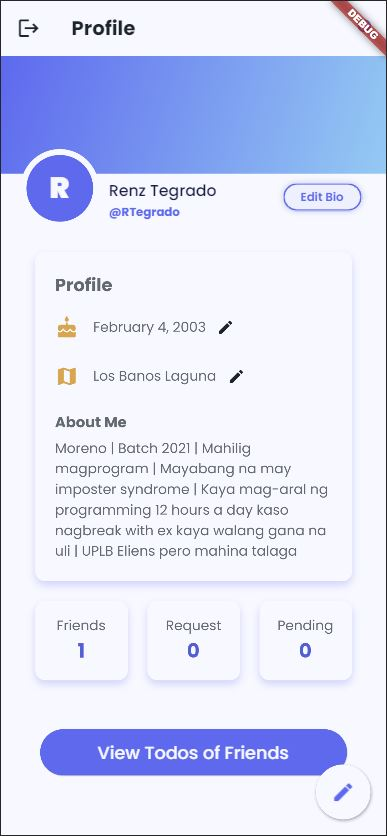
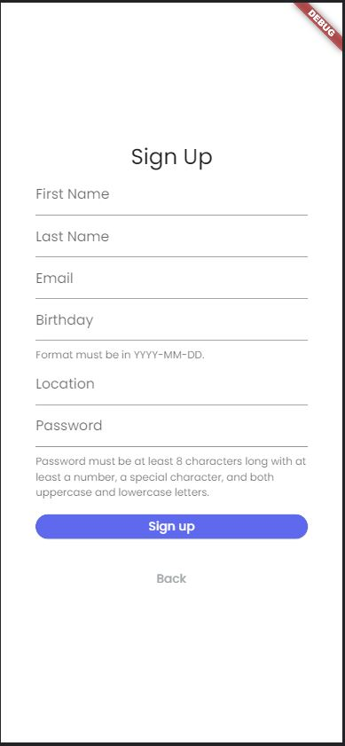

### Name

-   Kenneth Renz A. Tegrado

### Student Number

-   202109799

### Section

-   D6L

## <!-- PROJECT SPECS -->

---

# Final Project

This is a social media application built with Firebase as a backend service and Flutter for the UI look of the application. It utilizes the built-in CRUD methods on Firestore to create a seemingly flawless Social Media Todo Application.

## Features and Tasks that were successfully implemented

-   **Sign-up**
    -   [x] When signing-up, the user must provide the following:
        -   First Name
        -   Last Name
        -   Birthdate
        -   Location
        -   Email
        -   Password
    -   [x] Must have a validator for each field
    -   [x] Email should be unique
    -   [x] Password must be at least 8 characters long with at least a number, a special character, and both uppercase and lowercase letters.
    -   [x] ID is auto-generated.
-   **Login/Logout**
    -   [x] User Firebase Authentication using username and password.
    -   [x] Must have a validator for each field.
-   **User Profile**
    -   [x] Shows the Username, Name, Bdate, Location, and Bio
-   **Friend Feature**

    -   [x] Must show the list of friends and friend requests.
    -   [x] When the user clicks one friend in the friends list, the profile should be shown.
    -   [x] The profile is composed of ID, Name, Bdate, Location, and Bio.

-   **Search Friend**

    -   [x] Search bar that finds users containing the search string. The user don’t necessarily need to type the whole username to find a match.
    -   [x] Each output searched users must have an add friend button (unless the searched user is already a friend).

-   **Shared Todo**
    -   [x] All friends can see your todo and you can also see your friend’s todo list.
    -   [x] Add a todo.
        -   Only the owner can create a todo.
        -   Composed of Title, Description, Status, Deadline, Notifications.
    -   [x] Edit todo
        -   User and friends can edit the todo, must show the name of last edit and timestamp.
    -   [x] Delete todo
        -   Only the owner can delete a todo.
    -   [x] Status Change
        -   Only owner can change the status.
    -   [ ] Todo Notifications
        -   Using notifications (local, push notifs, etc)
        -   Example: Push notification for upcoming deadline, Friend edited your todo, etc
        -   Bonus if deadlines are connected to the phone calendar.

## Project Schedule

After the discussions in the laboratory, you are required to start with the project. Here is the table schedule with expected minimum output for the milestones. These milestones will be checked during lab hours. Each milestone is equivalent to 5 points for the project.
| Date | Milestone | Minimum Expected Output
|--|--|--|
| 21 Nov - 25 Nov | Milestone 01 | Create firebase, fetch/add information in firebase |
| 28 Nov - 02 Dec | Milestone 02 | UI and Navigation |
| 05 Dec - 09 Dec | Milestone 03 | Add, Search, Todo |
| 12 Dec - 14 Dec | Finalize Project

## Project Deadline

The deadline for the project is on December 14, 2022, Wednesday. All changes after the said date will not be considered.
The start of the project presentation is on December 15,2022 until December 21, 2022, during laboratory hours.

## Project Grading Scale

Here is the table for the point equivalents for each feature
| # | Feature | Points
|--|--|--|
| 1 | Signup, Login, Logout via Firebase | 10 points
| 2 | Add, View, and Search Friends | 30 points
| 3 | Shared Todo List | 25 points

## Screenshot Snippets

 
 

---

## Things you did in the code

-   I utilized the template provided from the course, and added some features that was needed for the exercise. I implemented a provider for the error messages, so that my form fields will not reset due to state changes. Using states in my forms resulted in all fields being cleared whenever I invoked the setState method. This behavior is not what I wanted with my fields whenever there is an error returned from the response from the API. This event made me use the provider to prompt responses to the UI.
-   I utilized the functions already available from the cloud firestore package to implement all of the backend logics in my program.

---

## Challenges faced when developing the app

Particularly, I had a hard time implementing the notification system because my lack of knowledge. At the same time, I was unable to find any resources related to working with notifications with Flutter because of time constraints. This limitation is the reason why I decided that I will not be able to implement the notification system.

---

## Test Cases

#### Happy Paths

-   [x] Check if my confirmation modal is working
    -   [x] check if the dialog box appears with a click of a button
    -   [x] check if the number of widgets rendered is correct
    -   [x] check if the messages were properly displayed
    -   [x] check if the dialog boxes closes when the close button was clicked
-   [x] Check if my edit dialog is working
    -   [x] check if the dialog box appears with a click of a button
    -   [x] check if it opens another dialog box when an edit button was clicked

#### Unhappy Paths

-   [x] Check if my edit dialog prompts the proper error messages
    -   [x] check if edit dialog prompts the user with an error text when they submitted an empty field when trying to change the title of a todo
    -   [x] check if edit dialog prompts the user with an error text when they submitted an empty field when trying to change the description of a todo
    -   [x] check if edit dialog prompts the user with an error text when they submitted an empty field when trying to change the deadline of a todo
    -   [x] check if edit dialog prompts the user with an error text when they submitted an invalid deadline format when trying to change the deadline of a todo

---

## Resources

-   [Flutter Documentation](https://docs.flutter.dev/)
-   [Cloud Firestore Documentation](https://firebase.google.com/docs/firestore)
-   [Working with Datetime Class](https://api.dart.dev/stable/2.18.6/dart-core/DateTime-class.html)
-   [Flutter Icons](https://api.flutter.dev/flutter/material/Icons-class.html)
-   [Mobile App UI Color Generator](https://mobilepalette.colorion.co/)
-   [Making your own themes in Flutter](https://www.google.com/search?q=creating+your+own+themes+in+flutter&oq=creating+your+own+themes+in+flutter&aqs=chrome..69i57j33i10i160l3j33i22i29i30l4.6417j0j4&sourceid=chrome&ie=UTF-8)
-   [Gradient Designs in Flutter](https://www.geeksforgeeks.org/gradient-in-flutter-applications/)
-   [Widget Testing](https://docs.flutter.dev/cookbook/testing/widget/introduction)
